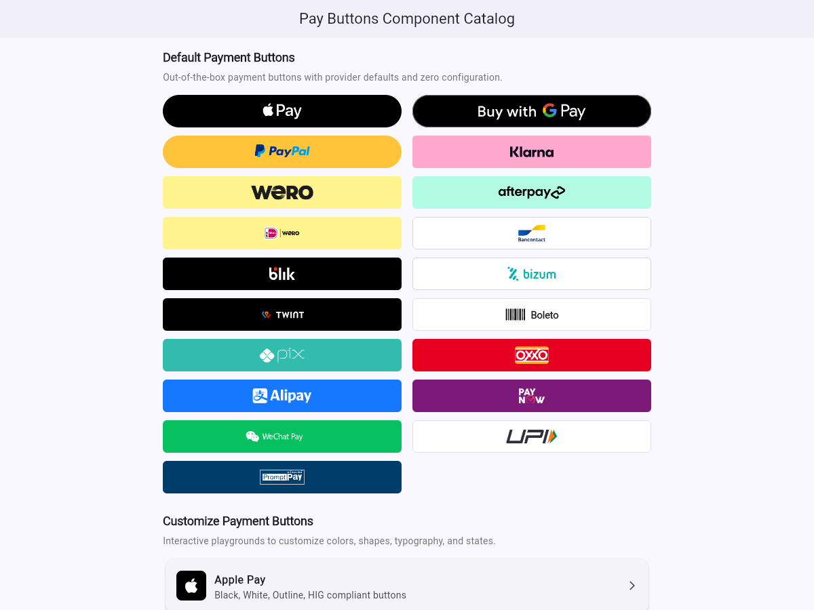

# pay_buttons

[](https://pub.dev)
[](file:///Users/robert/Developer/AndroidStudioProjects/pay_buttons/LICENSE)
[](https://robert-sd.github.io/pay_buttons/)

A high-fidelity, brand-compliant, cross-platform Flutter package providing dedicated payment buttons for modern e-commerce checkouts.

Designed with **zero native SDK bloat**, instant 120 FPS rendering, full accessibility semantics, and strict adherence to provider brand guidelines.

> 🌐 **Live Web Component Catalog**: Test and interact with the payment buttons directly in your browser at **[robert-sd.github.io/pay_buttons](https://robert-sd.github.io/pay_buttons/)**.

<p align="center">
  <a href="https://robert-sd.github.io/pay_buttons/">
    
  </a>
  <br />
  <sub>👉 <em>Click image above to open the live interactive demo in your browser</em></sub>
</p>

---

## Supported Buttons

* **Apple Pay**: Rendered only with Apple's own controls — the native PassKit button on iOS, and the official Apple Pay JS SDK `<apple-pay-button>` element in supporting browsers. Renders nothing on Android, desktop, and browsers without Apple Pay, because Apple's guidelines forbid drawing the mark.
* **Google Pay**: Provided directly via re-export of the official Flutter [`pay`](https://pub.dev/packages/pay) package (`GooglePayButton`, `RawGooglePayButton`).
* **PayPal & PayPal Pay Later**: Default logo-only or custom text (`gold`, `blue`, `black`, `white`, `silver`).
* **Amazon Pay**: Default logo-only or custom text (`gold`, `lightGray`, `darkGray`).
* **Klarna**: Default logo-only or custom text (`pink`, `black`, `white`).
* **Wero**: Europe 🇪🇺 / European Payments Initiative (`yellow`, `black`, `white`).
* **Shop Pay (Shopify)**: Default logo-only or custom text (`purple`, `black`, `white`).
* **Afterpay / Clearpay**: Default logo-only or custom text, Auto-brand switching (Afterpay in US/AU/NZ/CA, Clearpay in UK/EU), (`mint`, `black`, `white`).
* **TWINT**: Switzerland 🇨🇭 national mobile payment (`black`, `white`).
* **BLIK**: Poland 🇵🇱 mobile banking champion (`black`, `white`).
* **iDEAL**: Netherlands 🇳🇱 online banking standard (`white`, `black`).
* **Bizum**: Spain 🇪🇸 instant account payment (`white`, `darkTeal`).
* **Pix**: Brazil 🇧🇷 instant payment system by Banco Central do Brasil (`teal`, `white`, `black`).
* **OXXO**: Mexico 🇲🇽 market leader cash voucher & digital payment (`red`, `white`, `yellow`).
* **Boleto Bancário**: Brazil 🇧🇷 official barcode bank slip checkout (`white`, `black`, `lightGray`).


---

## Quick Start

### Apple Pay
```dart
// Renders Apple's own control: PKPaymentButton on iOS, or the Apple Pay JS
// SDK element in supporting browsers. Renders nothing elsewhere.
ApplePayButton(
  onPressed: () => handleApplePay(),
  color: ApplePayColor.black,
  type: ApplePayType.buy,   // "Buy with Apple Pay"
)

// Hide the button when you already know Apple Pay is unavailable.
ApplePayButton(
  userCanPay: isApplePayAvailable,
  onPressed: () => handleApplePay(),
)
```

> [!IMPORTANT]
> Apple's guidelines do not permit reproducing the Apple Pay mark or composing
> a button from it. `ApplePayButton` therefore never draws a fallback button —
> it renders an empty box on Android, desktop, and browsers without Apple Pay.
> If you need a checkout option on those platforms, use another button from
> this package alongside it.

### Google Pay (via `pay` package)
```dart
// Native Google Pay Button from official pay package
RawGooglePayButton(
  paymentConfiguration: paymentConfig,
  theme: GooglePayButtonTheme.dark,
  type: GooglePayButtonType.pay,
  onPressed: () => handleGooglePay(),
)
```

### PayPal
```dart
PayPalButton(
  onPressed: () => handlePayPalCheckout(),
  text: 'Checkout', // Optional custom text, defaults to null (logo only)
  color: PayPalColor.gold,
  shape: PayPalShape.pill,
)
```

### Amazon Pay
```dart
AmazonPayButton(
  onPressed: () => handleAmazonPay(),
  text: 'Check out with',
  color: AmazonPayColor.gold,
  shape: AmazonPayShape.pill,
)
```

### Klarna
```dart
KlarnaButton(
  onPressed: () => handleKlarnaCheckout(),
  text: 'Pay with',
  color: KlarnaColor.pink,
  shape: KlarnaShape.rounded,
)
```

### Wero
```dart
WeroButton(
  onPressed: () => handleWero(),
  text: 'Pay with',
  color: WeroColor.yellow,
  shape: WeroShape.rounded,
)
```

### Shop Pay
```dart
ShopPayButton(
  onPressed: () => handleShopPay(),
  text: 'Buy with',
  color: ShopPayColor.purple,
  shape: ShopPayShape.rounded,
)
```

### Afterpay / Clearpay
```dart
AfterpayButton(
  onPressed: () => handleAfterpay(),
  text: 'Buy now with',
  brand: AfterpayBrand.afterpay, // or AfterpayBrand.clearpay,
  color: AfterpayColor.mint,
  shape: AfterpayShape.rounded,
)
```

### Regional Champions

```dart
// Switzerland
TwintButton(
  text: 'Bezahlen mit',
  onPressed: () => handleTwint(),
)

// Poland
BlikButton(
  text: 'Zapłać z',
  onPressed: () => handleBlik(),
)

// Netherlands
IdealButton(
  text: 'Betaal met',
  onPressed: () => handleIdeal(),
)

// Belgium
BancontactButton(
  text: 'Betaal met',
  onPressed: () => handleBancontact(),
)

// Spain
BizumButton(
  text: 'Pagar con',
  onPressed: () => handleBizum(),
)

// Brazil (Pix)
PixButton(
  text: 'Pagar com',
  color: PixColor.teal,
  onPressed: () => handlePix(),
)

// Mexico (OXXO)
OxxoButton(
  text: 'Pagar con',
  color: OxxoColor.red,
  onPressed: () => handleOxxo(),
)

// Brazil (Boleto Bancário)
BoletoButton(
  text: 'Pagar via',
  color: BoletoColor.white,
  onPressed: () => handleBoleto(),
)
```


---

## Typography & Custom Fonts (MIT Compliant)

All payment buttons support custom typography out of the box while remaining **100% compliant with the MIT open-source license**.

### Examples

#### 1. Custom `fontFamily` & Fallbacks
```dart
KlarnaButton(
  text: 'Pay in 4 with',
  fontFamily: 'MyCustomFont',
  fontFamilyFallback: PayButtonFonts.klarna,
  onPressed: () => handleCheckout(),
)
```

#### 2. Using `GoogleFonts` with `textStyle`
```dart
import 'package:google_fonts/google_fonts.dart';

PayPalButton(
  text: 'Checkout',
  textStyle: GoogleFonts.inter(
    fontWeight: FontWeight.w600,
    letterSpacing: -0.2,
  ),
  onPressed: () => handleCheckout(),
)
```

---

## Legal & Trademark Disclaimers

### 1. Non-Affiliation
This package is an independent open-source library and is **not affiliated with, authorized, maintained, sponsored, or endorsed by PayPal, Inc.**, Klarna Bank AB, Amazon.com, Inc., or any other payment provider.

### 2. Nominative Fair Use
All trademarks, logos, and service marks displayed in this package belong to their respective owners. They are used solely under the doctrine of **nominative fair use** to identify the payment services accepted by merchants and to assist developers in building brand-compliant checkout buttons.

### 3. Open Source Licensure
The vector paths used to render the PayPal logo are derived from PayPal's official open-source repository [`@paypal/sdk-logos`](https://github.com/paypal/paypal-sdk-logos), published by PayPal under the **Apache License, Version 2.0**. Braintree developer components are licensed under the **MIT License**.

See [**`LICENSE`**](file:///Users/robert/Developer/AndroidStudioProjects/pay_buttons/LICENSE) and [**`TRADEMARKS.md`**](file:///Users/robert/Developer/AndroidStudioProjects/pay_buttons/TRADEMARKS.md) for full terms.
